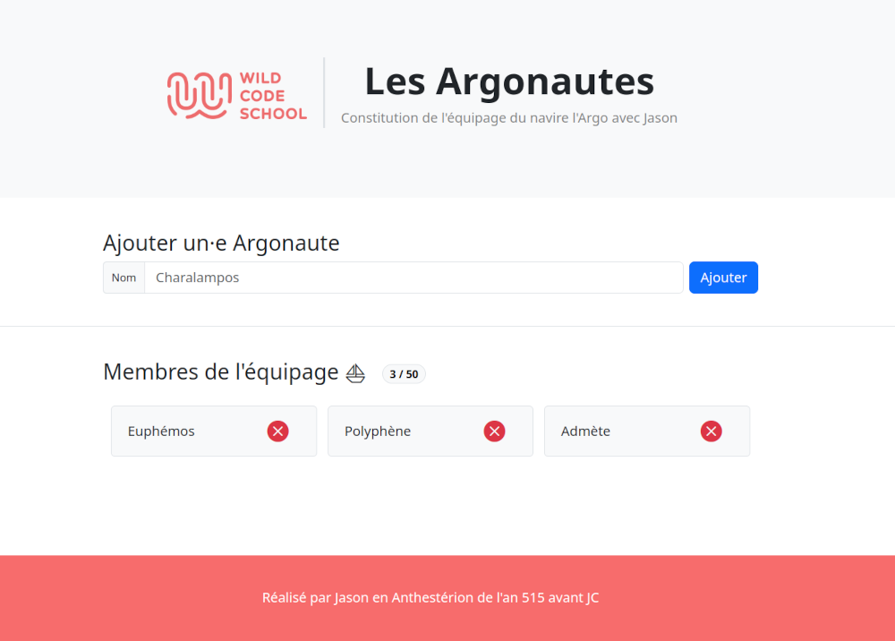

# Argonaut crew ⛵
Wild Code School Challenge : help Jason build his crew with a web form
- Build a simple web app
- Store data into a data base

**Features**
- Front-end : SPA with a form
- Back-end : CRUD Database and API Calls : get, add, delete

**Stack Choice : MERN**
- Front-end : yarn, Vite, React, Axios
- Back-end : yarn, Node, Express, MongoDB (Cloud Atlas)

## ✨ Demo
- https://argonautes.onrender.com/ : Very slow to access to onrender.com !

## 🚨 Prerequisites
- Node
- Yarn

## 🛠️ Installation
- cd client && yarn install
- cd server && yarn install

## 🚀 Usage
- cd client && yarn dev
- cd server && yarn dev

## 👤 Author
- [@jeromeabel](https://github.com/jeromeabel)

## 📝 License
- [GNU--GPL--3](https://www.gnu.org/licenses/gpl-3.0.fr.html) licensed.